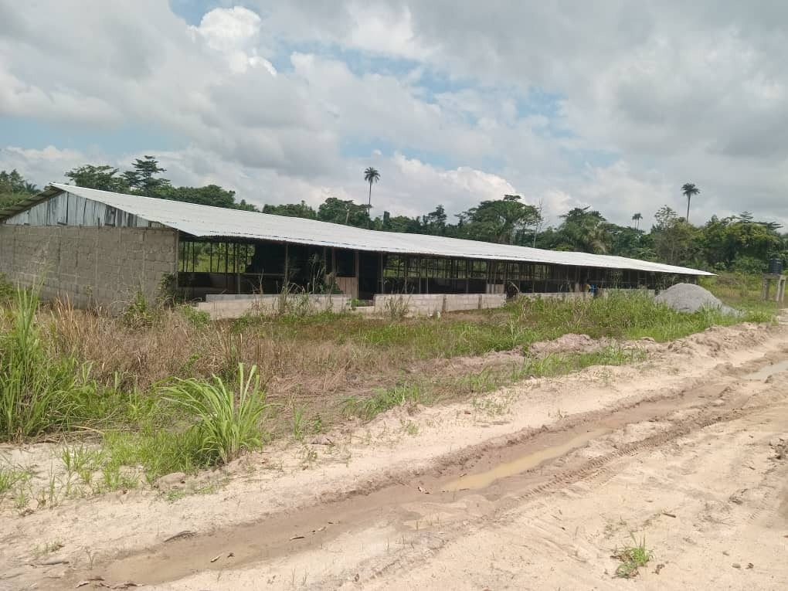
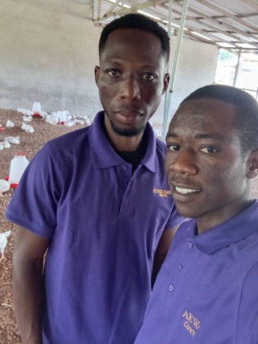
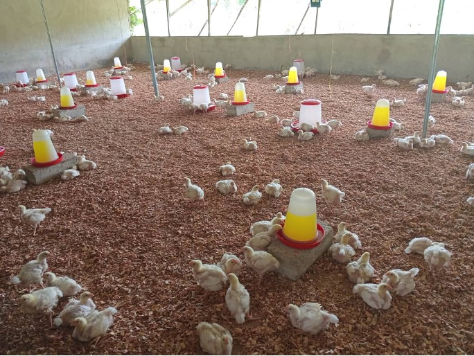
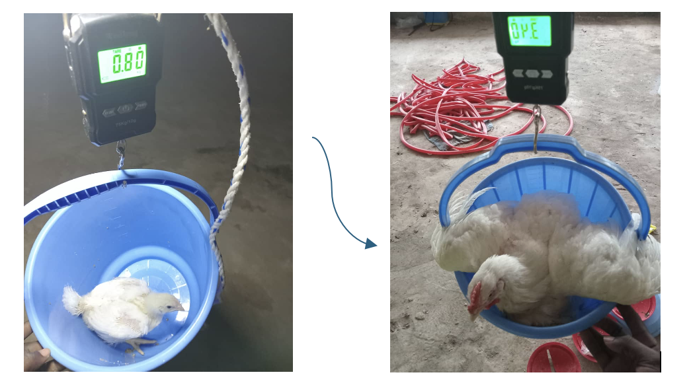
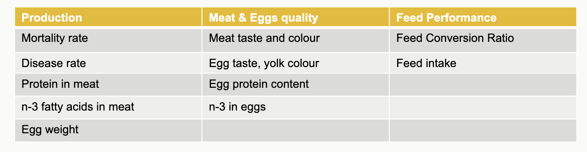
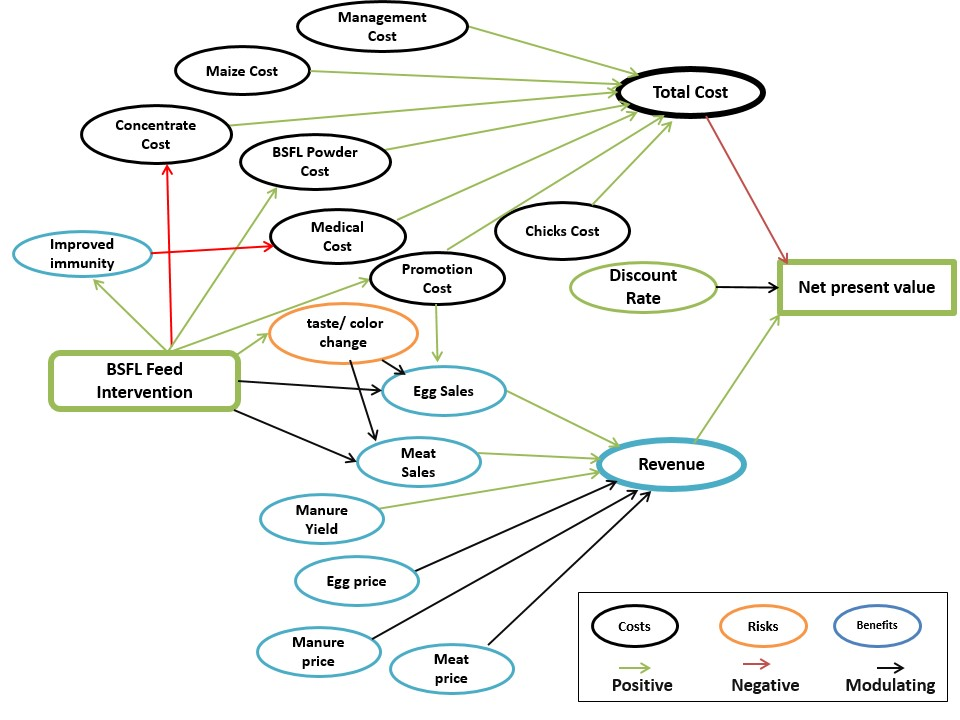

<style>
  .author {
    color: grey;
    margin-top: 20px;
    font-size: 20px;
  }
  .date {
  color: grey;
  margin-top: 20px;
  font-size: 16px;
}
</style>

```{r setup, include=FALSE, warning=FALSE, message=FALSE}
knitr::opts_chunk$set(echo = TRUE)
library(decisionSupport)
library(gtExtras)
library(svglite)
library(gtsummary)
library(kableExtra)
library(dplyr)
library(patchwork)
library(ggplot2)
source("DA_function.R")
```

<br>

---

### Poultry farm in Juaben, Ashanti-Region of Ghana

The poultry project was started on 14 acres of land in 2022, there is one coop built with 5 rooms of each 15x15 meters.



<br>

Primarily a broiler farm, we added 500 layers in 2025.

Currently we rear about 1000-2000 chicken, which requires one to two caretakers to manage feed, water, cleaning and medication. Currently we have one caretaker with a bachelor’s degree in general agriculture and a farm manager who has a master’s degree in agriculture and a few years hands on experience in poultry farm work.



<br>

For Broilers, a production cycle is about 6-10 weeks, depending on the weight that shall be achieved, for example 1.5kg can be reached by 4 weeks, 2.5 by six weeks. For broilers the farm uses either the Cobb500 or Ross 308 breed as they are high-performing and still heat and disease resistant, especially the latter.



<br>

These are about 4 weeks old and have just left the brooding area.



<br>

As the main cost factor in poultry production is the feed&mdash; which makes up to about 80% of the overall cost&mdash; the major goal is to reduce feed cost to maximize profits while still trying to be as sustainable as possible. Regular ready-made feed contains about 20 to 23% of protein depending on the life stage of the birds, while the protein is soymeal. Additionally, the concentrate contains salt, vitamins, fat and for the layers some form of calcium. Usually, we buy a bag of concentrate which contains 35% protein and mix it with maize only in a ratio of 1:2. For the concentrate-maize-mixture we use Koudijs concentrate  for 590 GHC per 50kg and add maize for 310 per 50 kg. A ton of feed will contain 750 kg bags of concentrate and 1350 kg bags of maize. A ton will cost us 8160 GHC (7x590+13x310). As the concentrate is the most expensive component we are trying to find ways to reduce the price for the concentrate. An option is soldier fly maggot meal for price of 300 GHC per 50kg. It contains around 56% protein which is 37,5% more than the soy-concentrate. Assuming that the availability of the protein part is similar, we can reduce the amount of protein by 37,5% as well, we would only need 31,25kg of protein for the same amount of maize. This equals 5 bags of Maggot meal protein per ton, 15 bags of maize. A ton of feed with maggot meal as the protein part will cost 6150 GHC (5x300+15x310). Assuming the month has 30 days and the flock consumes an average 4 kg per bird per month, a batch of 500 chicken would consume two tons of feed, saving 4020 GHC of feed cost with the replacement protein. Assuming at full capacity the farm can hold 7500 chickens, using Soldier Fly maggot meal could save about 60.300 GHC monthly.

Decision makers in this scenario are the owners of the farms, stakeholders are the offtakers of broilers and eggs as well as the end-consumers. The decision to be made is if we shall replace the protein concentrate by Black Soldier Fly Larvae (BSFL) meal. Our objective is to reduce the feeding cost without a decrease in quality or quantity. 

The following are the variables of interest, which we might need to have more information to make a better decision.




<br>


### Literature Review

An overview of past literature on the impact of Black Soldier Fly Larvae (BSFL) feed on poultry meat and egg quality, as well as its economic impact on poultry farms, is discussed here.

<br>

#### Effects of Black Soldier Fly Larvae (BSFL) Feeds on Yield and Sensory Attributes

BSFL feeds generally maintain or improve yield parameters like body weight, feed conversion, and meat cuts in broilers, while also positively influencing sensory attributes such as yolk color in laying hens and meat flavour/sweetness in broilers ([@patterson_impact_2021]. However, higher inclusion levels for laying hens have the potential for increased lauric acid in broiler meat lipids, which is considered dietetically undesirable for human nutrition, despite not significantly impacting overall consumer acceptance [@patterson_impact_2021]. According to [@nguyen_effects_2024], supplementing BSFL meal at 6% to 12% resulted in enhanced growth rates compared to the control group, with significant differences from week 7 onwards. 

The study shows that the 12% inclusion group (EG2) had the highest average body weight (738.1 g), similar to the 6% group (EG1, 736 g), and notably surpassed the control (603 g).[@kieronczyk_black_2023] reported that BSFL larvae fat, particularly at 60 g/kg (HI06), resulted in comparable growth performance parameters to those achieved with dietary soybean oil, suggesting that BSFL larvae fat can fully replace soybean oil without detrimental effects due to similar energy densities. 

BSFL oil and meal can be used for egg production and yolk colouration. According to [@patterson_impact_2021], yolk colour was greater (darker) among hens fed BSFL oil compared to controls; a linear increase in dietary BSFL oil percentage resulted in darker yolk colour. Similarly, yolk colour was enhanced by all levels of BSFL meal, with 16% meal showing significantly greater yolk colour than controls. [@mwaniki_complete_2020] also reported increased yolk colour with greater amounts of BSFL meal.

Dietary inclusion of up to 15% BSFL meal in broiler chicken diets had significant effects on the sensory characteristics of cooked breast meat, including aroma, taste, and overall acceptability [@onsongo_performance_2017]. Another study on broilers also found that BSFL larvae fat did not impair physicochemical indices related to consumer acceptance, such as colour, pH, and water-holding capacity, to an extent that would negatively limit the final decision [@kieronczyk_black_2023]. However, [@nguyen_effects_2024] found that BSFL supplementation improved the flavour and sweetness of chicken meat, reflected in a higher content of glutamic acid.

<br>

####  Nutritional Value of Black Soldier Fly Larvae (BSFL) Feeds

Black Soldier Fly Larvae (BSFL) feeds are recognized as a promising alternative feed ingredient for poultry due to their rich nutritional profile. The United States Food and Drug Administration (US FDA) and the Association of American Feed Control Officials have approved BSFL as a feed ingredient for poultry [@patterson_impact_2021]. BSFL can be a concentrated source of various nutrients depending on its developmental stage. They are rich in crude protein (CP), lipids (ether extract, EE), and minerals such as calcium and phosphorus [@marono_productive_2017, @mwaniki_egg_2018]. However, their precise nutritional composition is influenced by factors such as the larval developmental stage, the type of substrate they are reared on, and the processing methods used [@patterson_impact_2021].  The dry matter (DM) content of BSFL larvae is typically high, reported around 97.0% to 96.94% for BSFL [@patterson_impact_2021,@onsongo_performance_2017]. 

**Crude Protein (CP):** Analyzed CP values for BSFL meal vary, with one study reporting 46.30% [@patterson_impact_2021] and another 43.9% [@onsongo_performance_2017]. Some sources cite ranges from 35% to 57% or 36.9% to 43.6% [@veldkamp_insects_2012].  Although BSF larvae on average contain both a high protein and fat content [@zheng_double_2012], the body composition of the larvae depends on the quality and quantity of food ingested [@nguyen_effects_2024]. Others have found protein contents that range from 35% crude protein [@haasbroek_use_2016] to 44% protein [@surendra_bioconversion_2016] for dried full-fat BSF larvae. BSF larvae have been found to contain 58-72% saturated fatty acids and 19-40% mono- and poly-unsaturated fatty acids of total fat content containing high levels of lauric, palmitic and oleic acid [@surendra_bioconversion_2016].

**Amino acid content of Black Soldier Fly:** The amino acid (AA) composition of BSF is rich in methionine and lysine (9.05 and 22.3 g/kg DM, respectively [@oonincx_feed_2015]
Fatty acid percentage of Black Soldier Fly: Compared with other insects, the black soldier fly commonly contains a higher amount of fat (up to approximately 40%) and is rich in saturated fatty acids (SFA), especially palmitic acid (C16:0) and lauric acid (C12:0). However, the fat content and fatty acid composition of the larvae dramatically vary (from 5% to 40% dry matter) with the rearing substrates [@riekkinen_effect_2022].

**Ether Extract (EE) / Fat:** BSFL are a concentrated source of lipids, with values around 28% or 11.90% for BSFL meal [@patterson_impact_2021]. Other reported ranges for BSFL larvae fat content are between 15.0% and 34.8% or even up to 47% on a dry matter basis . The fat content can vary widely depending on the substrate on which the larvae are reared.

<br>

#### Economic Effects of Black Soldier Fly Larvae (BSFL) Feeds in Poultry Production 

Including Black Soldier Fly Larvae (BSFL) feeds in poultry diets can have significant positive economic impacts, primarily by reducing feed costs and improving profitability. According to [@onsongo_performance_2017], BSFL meal can serve as a cheaper alternative protein source to conventional ingredients like soybean meal (SBM) and fish meal (FM). The study found that the cost of feed consumed gradually decreased as more SBM and FM were replaced with BSFL meal in the diets, from the control to the 15% BSFL inclusion (L3) diet. The potential for large-scale insect rearing, especially using bio-waste, further reduces production costs, making insect meal a viable and cheaper alternative to fish and soybean meal. This suggests that BSFL can be a sustainable and economically competitive alternative [ @heuel_black_2022]. 

In terms of profitability, replacing traditional protein sources with BSFL meal at up to 15% inclusion in broiler diets led to the highest Cost Benefit Ratio (CBR) and best Return on Investment (RoI) [@onsongo_performance_2017].


<br>


### Method


We did a cost-benefit comparison between the baseline (conventional feed) and the proposed intervention (Black Soldier Fly Larvae (BSFL) feed), using the `decisionSupport` package [@R-decisionSupport]. The baseline is to continue feeding the current feed of maize meal and soybean concentrate mixture, while the intervention is to replace the soybean with Black Soldier Fly powder in the concentrate. 

To do this analysis, we first identified the decision maker as the poultry farm owner, and stakehoders as the offtakers of broilers and eggs, along with the end consumers. We then drew a decision model to clearly delineate the impact pathway between different cost, benefit and risk variables, as shown in the figure below. 

<br>

{height=500px}

<br>

Estimate ranges for these various input variables were then collected from the decision maker and the stakeholders via the decision maker.These variables are related to costs (feed costs and farm operation costs, etc) and benefits (amount of egg sales and egg prices, etc) of our model. Since the farm in our study actually exists and already operating in Gana, nearly all our estimates were provided by the farm owner (the decision maker) herself. Hence, our estimates are relatively narrow, reflecting higher certainties. Our model includes one risk only, which is the risk of taste and/or color change due to BSFL feed. Since we could not adequately estimate the impact of this risk on the consumer acceptance of BSFL-fed eggs and meat, we used a wide range of estimate which covered nearly all possible values (probability range of 0.1 (5^th^ percentile) to 0.9 (95^th^ percentile) to justify our model. Although they may be other risks, such as risk of disease outbreak, these were not not included in our model because they would impact both the baseline and intervention models equally&mdash; our aim was to see the difference between baseline and intervention; not to get an accurate insight to the actual benefits. 

We then built a [decision model in R](https://github.com/Nasim-Ranjbar/Maggots-for-the-chickens/blob/main/DA_project.R) that incorporates expert knowledge, inputs from decision maker and stakeholders, as well as literature findings, for a simulation period of twelve years. We calculated the net present values of the baseline and intervention to compare the future profits in present values. 

We then ran the *Monte Carlo Simulation* ten thousands times using the `mcSimulation()` function in the `decisionSupport` package to generate the model results. We also did a cashflow analysis of the two options across the simulation timeline, and a *Projection to Latent Structures (PLS)* analysis as a post-hoc test to the simulation outputs. We did a *Value of Information (VoI) analysis*, and used the `multi_EVPI()` to calculate the *Expected Value of Perfect Information (EVPI)*. The EVPI provides information on the expected opportunity loss due to uncertainty, if the decision maker does not have a perfect information about certain variables.

Further details of our model and R-analysis can be accessed in [this GitHub repository.](https://github.com/Nasim-Ranjbar/Maggots-for-the-chickens)


<br>

### Result

#### Comparison of Net Present Value (NPV) distributions

Compared to the baseline feed, the expected NPV distribution of the intervention using BSFL feed shows greater uncertainty, but also a higher potential for profit. However, the decision maker may feel uneasy to make a decision of switching the feeds due to huge overlap between the two graphs, but as explained in the method section, the conditions for intervention scenario are intentionally worse than the baseline scenario. Hence, based on the graph below, we can make an assumption that even under unrealistically bad situations, the profits with BSFL feeds can at least be as good as or better than those of the baseline. 

Another notable thing is that the net present value (NPV) of baseline is negative on the lower end. This implies that the current farm operations can't provide sustainable profits in the 12 years time, and changes are needed. The NPV of the intervention also goes below zero on the lower end, but since we build the intervention scenario unrealistically unprofitable, we can't assume the new farm expansion model with BSFL feed can potentially be a failure&mdash; need to build a new model under more realistic conditions. At least we can now be certain that the profit of the BSFL intervention will not be much lower than that of the baseline. 

```{r result1}

DA_simulation_results <- mcSimulation(
  estimate = estimate_read_csv("data/DA_project.csv"),
  model_function = DA_function,
  numberOfModelRuns = 1e4, 
  functionSyntax = "plainNames")


# Plot distribution
plot_distributions(mcSimulation_object = DA_simulation_results, 
                   vars = c("NPV_baseline", 
                            "NPV_bsfl"),
                   old_names = c("NPV_baseline", "NPV_bsfl"),
                   new_names = c("NPV baseline feed", "NPV BSFL feed"),
                   method = 'smooth_simple_overlay', 
                   base_size = 7, 
                   x_axis_name = "Net Present Value (NPV) outcomes (GHC)")


```

<br>

The boxplots below show the median (central line), the 25th and 75th percentiles (edges of the box) and any outliers (light circles outside the boxes) of the two NPV distributions. The boxplots also show better potential profit for the BSFL intervention than the baseline's.

```{r result2}

plot_distributions(mcSimulation_object = DA_simulation_results, 
                   vars = c("NPV_baseline","NPV_bsfl"),
                   old_names = c("NPV_baseline", "NPV_bsfl"),
                   new_names = c("NPV baseline feed", "NPV BSFL feed"),
                   method = "boxplot", 
                   base_size = 11, 
                   x_axis_name = "Net Present Value (NPV) outcomes (GHC)")

```

<br>

The figure below shows the distribution of the value of the decision&mdash; that is, the difference in the net present values (NPV) of the baseline and the intervention. It represents the distribution of the expected value (profit) if we make the decision to implement the intervention.

At a first glance, this result seems bad, but remember that we made the intervention scenario unrealistically challenging. So, this is a typical "stress test" scenario, and here we are interested in where majority of density points lie&mdash; the peak and area under the curve. We can clearly see the majority lies on the positive side&mdash; more potential for profit, and we can also see values for the worst possible loss if we make the decision. 


```{r result3}

plot_distributions(mcSimulation_object = DA_simulation_results, 
                   vars = "NPV_decision",
                   old_names = "NPV_decision",
                   new_names = "NPV decision",
                   method = "boxplot_density", 
                   base_size = 10, 
                   x_axis_name = "Net Present Value (NPV) outcomes (GHC)")

```

<br>

##### Summary of Net Present Value (NPV) across scenarios

```{r result4}

kable((summary(DA_simulation_results$y[1:3]))) %>%
  kable_styling(
    bootstrap_options = c("striped", "hover", "condensed", "responsive"),
    position = "center",   
    font_size = 12  
    )
  
```

<br>

#### Distribution of cost savings from the intervention

The motivation behind this intervention was the significantly lower cost of Black Soldier Fly Larvae (BSFL) powder compared to soybean meal. The figures below show the cost avoided by implementing the intervention and the cost savings from replacing feed with BSFL.

<br>

##### Comparison of total costs between baseline and intervention

```{r result5}

a <- plot_distributions(mcSimulation_object = DA_simulation_results, 
                   vars = c("total_baseline_cost","total_bsfl_cost"),
                   old_names = c("total_baseline_cost", "total_bsfl_cost"),
                   new_names = c("Total cost (Baseline)", "Total cost (Intervention)"),
                   method = "boxplot_density", 
                   base_size = 10, 
                   x_axis_name = "Ghanaian Cedi (GHC)")

b <- plot_distributions(mcSimulation_object = DA_simulation_results, 
                   vars = "total_cost_saved_with_intervention",
                   old_names = "total_cost_saved_with_intervention",
                   new_names = "Total cost saved",
                   method = "boxplot_density", 
                   base_size = 10, 
                   x_axis_name = "Ghanaian Cedi (GHC)")

(a + b + plot_layout(widths = c(2, 1))) # +
  # plot_annotation(title = "Cost Comparison and Cost Saving")

```

<br>

The plot for "Total cost saved" also shows negative values here, meaning it is possible that there will be extra costs rather than costs saved, with the intervention. This is due to the extra costs for farm expansion with the BSFL intervention. As mentioned in the method section, we increased all costs indiscriminately, whereas in reality, not all costs may increase with potential for lower costs with bulk purchase. Hence, we need to compare the feed costs separately to know how much cost will be saved when all other costs remain equal.

<br>

##### Summary of costs across scenarios 

```{r result6}

kable((summary(DA_simulation_results$y[40:42]))) %>%
  kable_styling(
    bootstrap_options = c("striped", "hover", "condensed", "responsive"),
    position = "center",   
    font_size = 12  
    )

```

<br>

##### Comparison of feed costs between baseline and intervention

The plots below compare the costs of feed between baseline and intervention, and show the amounts of cost saved for 12 years, if the current feed is replaced by the BSFL feed. 

```{r result7}

c <-plot_distributions(mcSimulation_object = DA_simulation_results, 
                   vars = c("total_baseline_feed_cost","total_bsfl_feed_cost"),
                   old_names = c("total_baseline_feed_cost", "total_bsfl_feed_cost"),
                   new_names = c("Total feed cost (Baseline)", 
                                 "Total feed cost (Intervention)"),
                   method = "boxplot_density", 
                   base_size = 10, 
                   x_axis_name = "Ghanaian Cedi (GHC)")

d <- plot_distributions(mcSimulation_object = DA_simulation_results, 
                   vars = "total_feed_cost_saved_with_intervention",
                   old_names = "total_feed_cost_saved_with_intervention",
                   new_names = "Total feed cost saved",
                   method = "boxplot_density", 
                   base_size = 10, 
                   x_axis_name = "Ghanaian Cedi (GHC)")

(c + d + plot_layout(widths = c(2, 1))) 

```

<br>

The yearly cost saved with BSFL meal replacement can be seen in the annual cashflow plot below. Lower amount of feed cost is saved every four year, due to no feed required for sold hens.

```{r result7a}

plot_cashflow(mcSimulation_object = DA_simulation_results,
              cashflow_var_name = "Cashflow_feed_cost_saved",
              x_axis_name = "Year",
              y_axis_name = "Cashflow in Ghanaian Cedi (GHC)") 


```

<br>

##### Summary of feed costs across scenarios

```{r result8}

kable((summary(DA_simulation_results$y[43:45]))) %>%
  kable_styling(
    bootstrap_options = c("striped", "hover", "condensed", "responsive"),
    position = "center",   
    font_size = 12  
    )

```

<br>

#### Cashflow analysis

The side-by-side comparison between the annual cashflows of the baseline and the intervention across the twelve years of simulation period is shown below. 

A dip in the cashflows can be seen every four years of the simulation period. This is in line with the operation structure of the model farm. The farm purchases day-old chicks in batches in a three-year cycle (3-1-0)&mdash; purchase three batches in the first year, followed by a batch purchase in the second year and no batch purchase in the third year. The chicks take four months of maturation period before laying eggs for the next 32 months. By the 37^th^month (the 4^th^ year), the spent hens are sold in batches, while replacing each batch sold with a new batch of day-old chicks. This event is indicated in the cashflow plots as a periodic dip every four year, when profit loss occurs with four months of egg-free period for the new chicks (maturation period) and no egg production after the sale of spent hens. 

Another thing to address here is the difference between the values at the starting points of cashflow for the baseline and intervention. The mean cashflow of the baseline starts at below zero, whereas that of the intervention is above zero. It may be assumed that this is due to lower feed cost with the BSFL, but it actually isn't so, since the total cost of the BSFL intervention can be higher due to the extra cost for farm expansion. This is due to the result of farm expansion and higher egg/meat sales in the BSFL intervention model. 

But, one may argue that cashflow at starting point should be similar between the baseline and the intervention, if reduced cost isn't really a key contributor. Then, we may first need to clarify the starting point. Is the starting point year one (as shown in the plots below) or the year four where the purchase of new chicks occur? In reality, changing of feed can occur in any year of the operation cycle. But, in our model, it is assumed that feed swap occurs when the new cycle starts, i.e., the year four. Hence, the actual starting point of our cashflow is the fourth year (of each cycle). The year one is merely a continuum of the year four (This is explained in the method section where the first year of 3-year purchase cycle is the fourth year of 4-year operation cycle). So, better cashflow in the fourth year results in higher cashflow in the first year, which we observed in the plots below. Then, why do we have higher cashflow in the fourth year (actual starting point of cashflow) in the intervention model than the baseline model? It is true that in other businesses, profit may take time to accumulate&mdash; time to gain customer base etc. But, eggs are produced and sold daily in a poultry farm. The eggs may also fetch the market price, since eggs are very sellable items in Gana as per our decision maker. So, there is no gap between investment and income generation, since both happen on a rolling basis. Hence, we can see the difference in cashflow even in the first year of the intervention.

Another thing to note here is that the annual casflow of the intervention displays wider margin for the percent quantile values, reflecting higher uncertainties in building the intervention model. Also a reminder that we build our intervention model in a "stress-test" style. Hence, we can expect far better cashflow under more realistic conditions.


```{r result9}

plot_cashflow(mcSimulation_object = DA_simulation_results,
              cashflow_var_name = c("Cashflow_baseline", "Cashflow_bsfl"),
              x_axis_name = "Year",
              y_axis_name = "Cashflow in Ghanaian Cedi (GHC)") 

```

<br>

#### Projection to Latent Structures (PLS) analysis

The figure below presents the variables most influential in predicting the decision outcomes, as identified by PLS analysis. The selling price per crate of 30 eggs is the most dominant variable in the outcome of both baseline and intervention models. The decision on whether to implement intervention is mostly influenced by the cost of BSFL powder and the increased cost of farm activities required to meet potential demand surges due to boosted sales.

```{r result10, warning=FALSE, message=FALSE}

#Find PLS result
input_table <- read.csv("data/DA_project.csv")

pls_result <- plsr.mcSimulation(object = DA_simulation_results,
                                resultName = names
                                (DA_simulation_results$y)[1], 
                                ncomp = 1) # baseline


pls_result_1 <- plsr.mcSimulation(object = DA_simulation_results,
                                resultName = names
                                (DA_simulation_results$y)[2], 
                                ncomp = 1) # bsfl

pls_result_2 <- plsr.mcSimulation(object = DA_simulation_results,
                                resultName = names
                                (DA_simulation_results$y)[3], 
                                ncomp = 1) # decision

# Generate all plots without x-axis labels and legends
e <- plot_pls(pls_result, input_table, threshold = 0.9) + 
  scale_x_continuous(limits = c(0, 7)) +
  annotate(geom = "text", x = 5, y = 2, label = "Baseline") +
  theme(axis.title.x = element_blank(),
        legend.position = "none")

f <- plot_pls(pls_result_1, input_table, threshold = 0.9) +
  scale_x_continuous(limits = c(0, 7)) +
  annotate(geom = "text", x = 5, y = 2, label = "Intervention") +
  theme(axis.title.x = element_blank(),
        legend.position = "none")

g <- plot_pls(pls_result_2, input_table, threshold = 0.9) +
  scale_x_continuous(limits = c(0, 7)) +
  annotate(geom = "text", x = 5, y = 2, label = "Decision") +
  theme(axis.title.x = element_text(size = 12)) &
  labs(x = "Variable of Importance in Projection")
  # keep legend only for this one

# Combine plots with one x-axis title and one legend
(e / f / g) +
  theme(plot.margin = margin(5, 5, 5, 5))


```


<br>

#### Value of Information (VoI) analysis

The figure below shows the expected value of perfect information (EVPI) for the variables important to the decision outcome. This EVPI plot aligns with the PLS plot for `NPV_decision`, where the cost of BSFL powder and the increased cost of farm activities required to meet potential demand surges due to boosted sales are the key factors. So, these two variables are important for our decision outcome, but how important are they? Here, the EVPI value for `Cost per 100 kg of BSFL powder (GHC)` is at 1000 GHC (approx. 83,25 Euro), while the value for `Percent cost increase with sale boosts (%)` is less than 250 GHC (approx. 20,81 Euro). So, the amount of money we should be willing to pay to get the perfect information for the two variables to improve our model is pretty low. This means that these two variables are important for our decision, but the current uncertainties of their values may impact little on the decision outcome&mdash; either our ranges of estimates are narrow enough or having more information may not necessarily change our decision.

```{r result11}

load("data/data_evpi_decision.Rda")

plot_evpi(evpi_decision, input_table = input_table, decision_vars = "NPV_decision")

```

<br>

#### Summary of input estimates and model outcomes

```{r result12}

mcSimulation_summary <- data.frame(DA_simulation_results$x[1:49], 
                                   DA_simulation_results$y[, c(1:3, 28:30)])

# Create summary table
summary_table <- mcSimulation_summary %>%
  tbl_summary(
    statistic = list(all_continuous() ~ "{mean} ± {sd}"),
    digits = all_continuous() ~ 2
  )

# Convert to data frame
summary_df <- as_tibble(summary_table$table_body) %>%
  select(label, stat_0) %>%
  rename(`Variable` = label,`Mean ± SD` = stat_0)%>%
  filter(
    !is.na(`Mean ± SD`),              
    !grepl("^[0-9.,%()\\s]+$", Variable)          
  )
# Display table
kable(summary_df) %>%
  kable_styling(
    bootstrap_options = c("striped", "hover", "condensed", "responsive"),
    position = "center",   
    font_size = 12  
    )


```

<br>

### Discussion

This BSFL model evaluates the financial implications of integrating Black Soldier Fly Larvae (BSFL) powder into poultry feed, comparing it with a conventional baseline system. Using Monte Carlo simulation, the model captures the uncertainty in key variables such as feed costs, egg yield, market prices and inflation. The model offers risk-based decision support, allowing users to explore profit ranges rather than relying on a single outcome. This is crucial in agri-food systems where uncertainty is inherent. 

At baseline, the farm is operational but the cashflow shows a need for expansion (every four year is a potential break even year or potential cost is higher than profit year. In years with full egg production, the profit margin does not reach it's maximum potential). According to the farm owner (decision maker), her farm can host 7500 birds, but at the moment the farm is operating with average of 2000 birds (maximum around 3000-4000). So, in order for the farm to thrive, either more birds should be reared or increase in egg prices occur (which showed up in the PLS analysis as the top variable for both baseline and intervention).

The intervention model incorporates the idea of farm expansion and so the benefits (also cashflow) we see here, also show what would be our new profit margin if the farm operates at higher capacity (we set the upper bound of percent increase in benefits around 0.9 percent of the baseline), and also the worst possible scenario if people don't accept the new eggs from BSFL-fed hens (lower bound of at 0.1 percent of the baseline). You can see from the result graphs and cashflow plots that despite high uncertainty, it shows a potential higher profit.

However, due to the farm structure, there is always a dip in profit from 4^th^ year, which extends till the 5^th^ year in every 4-year cycle. Hence, the farm owner should try out new purchase combination for day-old chicks, although it is sensible to buy new batch when income is generated when the old batch is sold.

An advantage of the model is that it provides a rough insight into the current situation of the farm and analyase possible solution. But, the model has a disadvantage that it is inflexible and currently only accommodate one farm (the model farm in the study).

<br>

### Conclusion and Recommendation

The cost of BSFL powder is the most critical negative factor impacting the profitability of a BSFL project. Using BSFL feed is likely to be more profitable than conventional concentrate feed in 
poultry production, as long as its cost is controlled and consumers accept the product. The BSFL option consistently shows higher Net Present Value (NPV) and more favourable median cash flows, indicating better long-term financial performance. With proper cost management, good marketing, and consumer education, BSFL feed can be a financially smart poultry producers in Ghana and similar contexts.

It is recommended to monitor egg prices and collect customer feedback on taste and appearance to guide pricing and marketing decisions. We can also make the codes of our model more flexible to allow testing with different purchase structure and farm rotation&mdash; a more generalizable model. Additionally in the future, the model can be extended to incorporate environmental benefits (waste reduction or lower emissions), which may enhance the overall value proposition of BSFL based feeding systems.


<br>

---

### References


